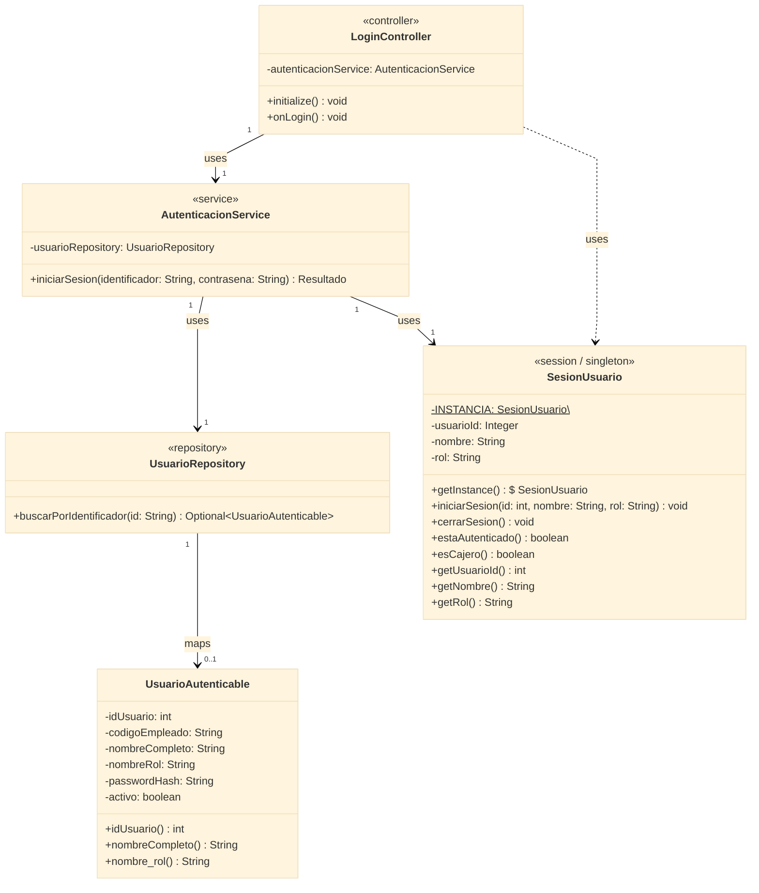

```mermaid
%%{init: { 'theme': 'base', 'flowchart': { 'curve': 'linear' }, 'class': { 'defaultRenderer': 'dagre-wrapper' } } }%%
classDiagram
    direction TB

    class LoginController {
        <<controller>>
        -autenticacionService: AutenticacionService
        +initialize() void
        +onLogin() void
    }

    class AutenticacionService {
        <<service>>
        -usuarioRepository: UsuarioRepository
        +iniciarSesion(identificador: String, contrasena: String) Resultado
    }

    class UsuarioRepository {
        <<repository>>
        +buscarPorIdentificador(id: String) Optional~UsuarioAutenticable~
    }

    class UsuarioAutenticable {
        
        -idUsuario: int
        -codigoEmpleado: String
        -nombreCompleto: String
        -nombreRol: String
        -passwordHash: String
        -activo: boolean
        +idUsuario() int
        +nombreCompleto() String
        +nombre_rol() String
    }

    class SesionUsuario {
        <<session / singleton>>
        -INSTANCIA: SesionUsuario\$
        -usuarioId: Integer
        -nombre: String
        -rol: String
        +getInstance()\$ SesionUsuario
        +iniciarSesion(id: int, nombre: String, rol: String) void
        +cerrarSesion() void
        +estaAutenticado() boolean
        +esCajero() boolean
        +getUsuarioId() int
        +getNombre() String
        +getRol() String
    }

    LoginController "1" --> "1" AutenticacionService : uses
    AutenticacionService "1" --> "1" UsuarioRepository : uses
    UsuarioRepository "1" --> "0..1" UsuarioAutenticable : maps
    AutenticacionService "1" --> "1" SesionUsuario : uses
    LoginController ..> SesionUsuario : uses
```
