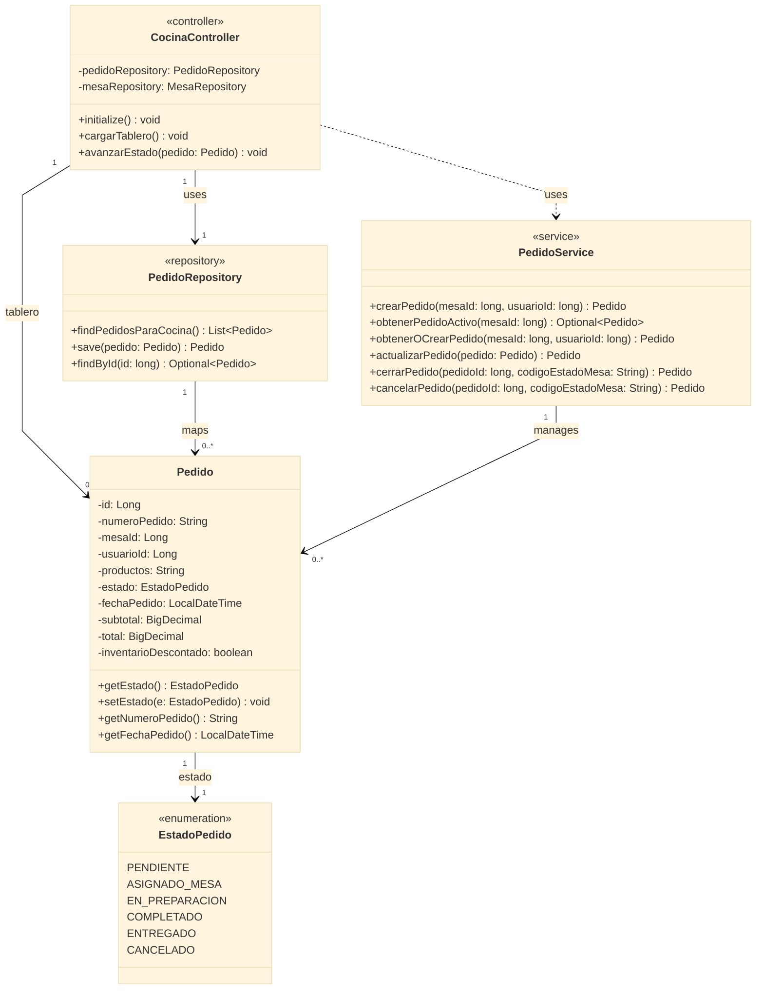

```mermaid
%%{init: { 'theme': 'base', 'flowchart': { 'curve': 'linear' }, 'class': { 'defaultRenderer': 'dagre-wrapper' } } }%%
classDiagram
    direction TB

    class CocinaController {
        <<controller>>
        -pedidoRepository: PedidoRepository
        -mesaRepository: MesaRepository
        +initialize() void
        +cargarTablero() void
        +avanzarEstado(pedido: Pedido) void
    }

    class PedidoService {
        <<service>>
        +crearPedido(mesaId: long, usuarioId: long) Pedido
        +obtenerPedidoActivo(mesaId: long) Optional~Pedido~
        +obtenerOCrearPedido(mesaId: long, usuarioId: long) Pedido
        +actualizarPedido(pedido: Pedido) Pedido
        +cerrarPedido(pedidoId: long, codigoEstadoMesa: String) Pedido
        +cancelarPedido(pedidoId: long, codigoEstadoMesa: String) Pedido
    }

    class PedidoRepository {
        <<repository>>
        +findPedidosParaCocina() List~Pedido~
        +save(pedido: Pedido) Pedido
        +findById(id: long) Optional~Pedido~
    }

    class Pedido {
        
        -id: Long
        -numeroPedido: String
        -mesaId: Long
        -usuarioId: Long
        -productos: String
        -estado: EstadoPedido
        -fechaPedido: LocalDateTime
        -subtotal: BigDecimal
        -total: BigDecimal
        -inventarioDescontado: boolean
        +getEstado() EstadoPedido
        +setEstado(e: EstadoPedido) void
        +getNumeroPedido() String
        +getFechaPedido() LocalDateTime
    }

    class EstadoPedido {
        <<enumeration>>
        PENDIENTE
        ASIGNADO_MESA
        EN_PREPARACION
        COMPLETADO
        ENTREGADO
        CANCELADO
    }

    CocinaController "1" --> "1" PedidoRepository : uses
    CocinaController "1" --> "0..*" Pedido : tablero
    PedidoRepository "1" --> "0..*" Pedido : maps
    PedidoService "1" --> "0..*" Pedido : manages
    Pedido "1" --> "1" EstadoPedido : estado
    CocinaController ..> PedidoService : uses
```
