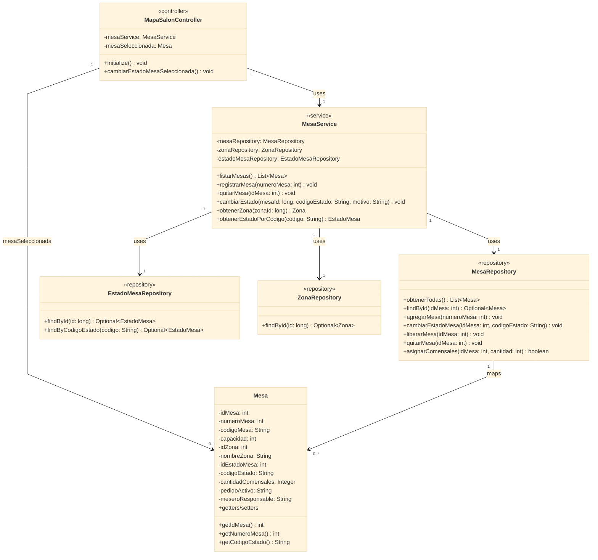

```mermaid
%%{init: { 'theme': 'base', 'flowchart': { 'curve': 'linear' }, 'class': { 'defaultRenderer': 'dagre-wrapper' } } }%%
classDiagram
    direction TB

    class MapaSalonController {
        <<controller>>
        -mesaService: MesaService
        -mesaSeleccionada: Mesa
        +initialize() void
        +cambiarEstadoMesaSeleccionada() void
    }

    class MesaService {
        <<service>>
        -mesaRepository: MesaRepository
        -zonaRepository: ZonaRepository
        -estadoMesaRepository: EstadoMesaRepository
        +listarMesas() List~Mesa~
        +registrarMesa(numeroMesa: int) void
        +quitarMesa(idMesa: int) void
        +cambiarEstado(mesaId: long, codigoEstado: String, motivo: String) void
        +obtenerZona(zonaId: long) Zona
        +obtenerEstadoPorCodigo(codigo: String) EstadoMesa
    }

    class MesaRepository {
        <<repository>>
        +obtenerTodas() List~Mesa~
        +findById(idMesa: int) Optional~Mesa~
        +agregarMesa(numeroMesa: int) void
        +cambiarEstadoMesa(idMesa: int, codigoEstado: String) void
        +liberarMesa(idMesa: int) void
        +quitarMesa(idMesa: int) void
        +asignarComensales(idMesa: int, cantidad: int) boolean
    }

    class EstadoMesaRepository {
        <<repository>>
        +findById(id: long) Optional~EstadoMesa~
        +findByCodigoEstado(codigo: String) Optional~EstadoMesa~
    }

    class ZonaRepository {
        <<repository>>
        +findById(id: long) Optional~Zona~
    }

    class Mesa {
        
        -idMesa: int
        -numeroMesa: int
        -codigoMesa: String
        -capacidad: int
        -idZona: int
        -nombreZona: String
        -idEstadoMesa: int
        -codigoEstado: String
        -cantidadComensales: Integer
        -pedidoActivo: String
        -meseroResponsable: String
        +getIdMesa() int
        +getNumeroMesa() int
        +getCodigoEstado() String
        +getters/setters
    }

    MapaSalonController "1" --> "1" MesaService : uses
    MapaSalonController "1" --> "0..1" Mesa : mesaSeleccionada
    MesaService "1" --> "1" MesaRepository : uses
    MesaService "1" --> "1" EstadoMesaRepository : uses
    MesaService "1" --> "1" ZonaRepository : uses
    MesaRepository "1" --> "0..*" Mesa : maps
```