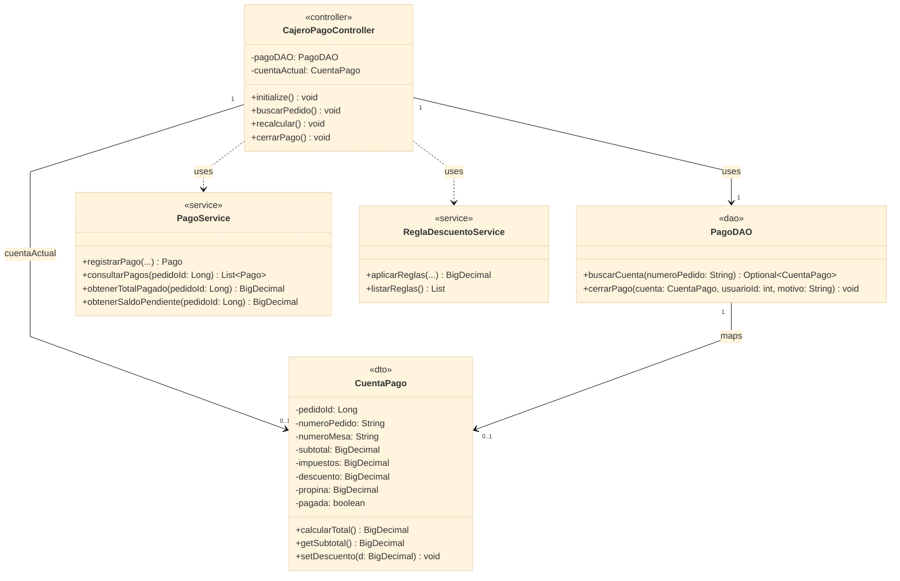

```mermaid
%%{init: { 'theme': 'base', 'flowchart': { 'curve': 'linear' }, 'class': { 'defaultRenderer': 'dagre-wrapper' } } }%%
classDiagram
    direction TB

    class CajeroPagoController {
        <<controller>>
        -pagoDAO: PagoDAO
        -cuentaActual: CuentaPago
        +initialize() void
        +buscarPedido() void
        +recalcular() void
        +cerrarPago() void
    }

    class PagoDAO {
        <<dao>>
        +buscarCuenta(numeroPedido: String) Optional~CuentaPago~
        +cerrarPago(cuenta: CuentaPago, usuarioId: int, motivo: String) void
    }

    class CuentaPago {
        <<dto>>
        -pedidoId: Long
        -numeroPedido: String
        -numeroMesa: String
        -subtotal: BigDecimal
        -impuestos: BigDecimal
        -descuento: BigDecimal
        -propina: BigDecimal
        -pagada: boolean
        +calcularTotal() BigDecimal
        +getSubtotal() BigDecimal
        +setDescuento(d: BigDecimal) void
    }

    class PagoService {
        <<service>>
        +registrarPago(...) Pago
        +consultarPagos(pedidoId: Long) List~Pago~
        +obtenerTotalPagado(pedidoId: Long) BigDecimal
        +obtenerSaldoPendiente(pedidoId: Long) BigDecimal
    }

    class ReglaDescuentoService {
        <<service>>
        +aplicarReglas(...) BigDecimal
        +listarReglas() List
    }

    CajeroPagoController "1" --> "1" PagoDAO : uses
    CajeroPagoController "1" --> "0..1" CuentaPago : cuentaActual
    PagoDAO "1" --> "0..1" CuentaPago : maps
    CajeroPagoController ..> ReglaDescuentoService : uses
    CajeroPagoController ..> PagoService : uses
```
