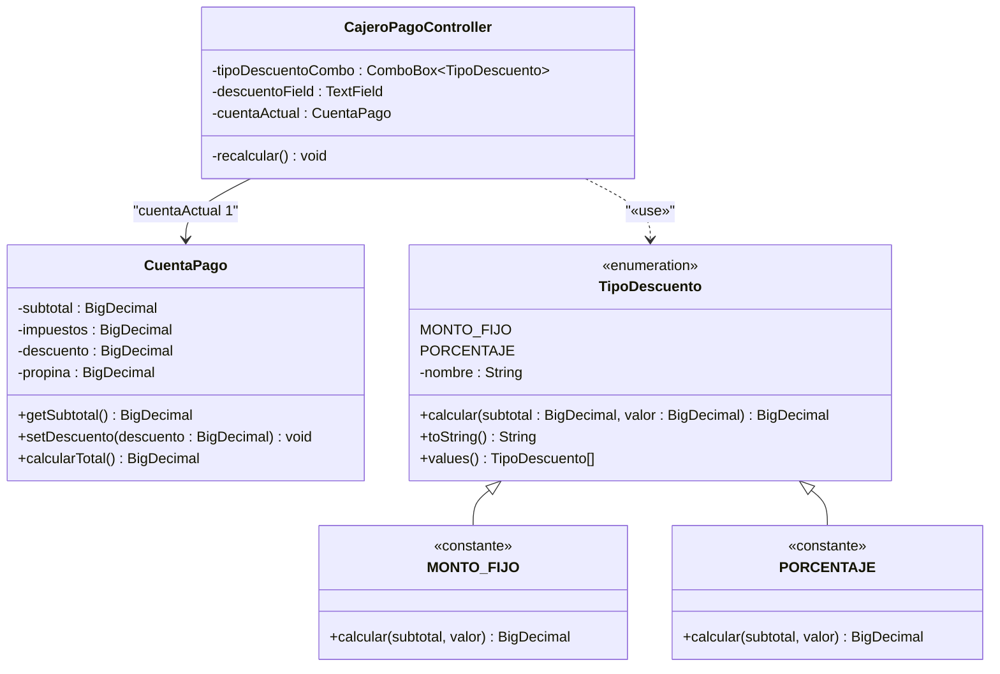

```mermaid
classDiagram
    direction TD

    class CajeroPagoController {
        -tipoDescuentoCombo : ComboBox~TipoDescuento~
        -descuentoField : TextField
        -cuentaActual : CuentaPago
        -recalcular() void
    }

    class CuentaPago {
        -subtotal : BigDecimal
        -impuestos : BigDecimal
        -descuento : BigDecimal
        -propina : BigDecimal
        +getSubtotal() BigDecimal
        +setDescuento(descuento : BigDecimal) void
        +calcularTotal() BigDecimal
    }

    class TipoDescuento {
        <<enumeration>>
        MONTO_FIJO
        PORCENTAJE
        -nombre : String
        +calcular(subtotal : BigDecimal, valor : BigDecimal) BigDecimal
        +toString() String
        +values() TipoDescuento[]
    }

    class MONTO_FIJO {
        <<constante>>
        +calcular(subtotal, valor) BigDecimal
        %% valor, a 2 decimales
    }

    class PORCENTAJE {
        <<constante>>
        +calcular(subtotal, valor) BigDecimal
        %% subtotal * valor / 100, a 2 decimales
    }

    %% Relaciones
    CajeroPagoController --> CuentaPago : "cuentaActual 1"
    CajeroPagoController ..> TipoDescuento : "«use»"
    TipoDescuento <|-- MONTO_FIJO
    TipoDescuento <|-- PORCENTAJE
```