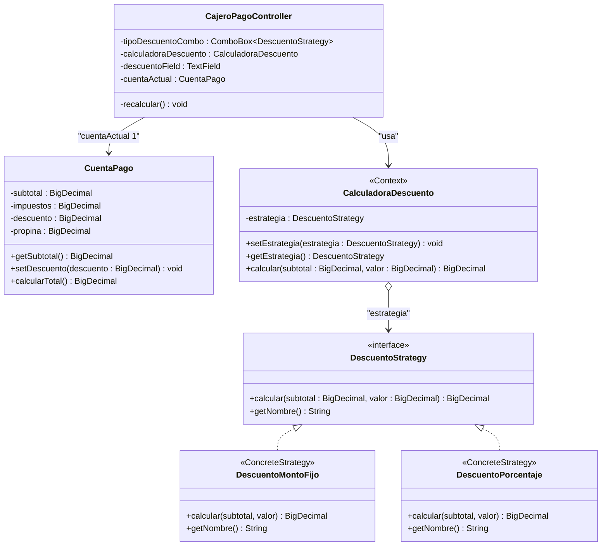

```mermaid
classDiagram
    direction TD

    class CajeroPagoController {
        -tipoDescuentoCombo : ComboBox~DescuentoStrategy~
        -calculadoraDescuento : CalculadoraDescuento
        -descuentoField : TextField
        -cuentaActual : CuentaPago
        -recalcular() void
    }

    class CuentaPago {
        -subtotal : BigDecimal
        -impuestos : BigDecimal
        -descuento : BigDecimal
        -propina : BigDecimal
        +getSubtotal() BigDecimal
        +setDescuento(descuento : BigDecimal) void
        +calcularTotal() BigDecimal
    }

    class CalculadoraDescuento {
        <<Context>>
        -estrategia : DescuentoStrategy
        +setEstrategia(estrategia : DescuentoStrategy) void
        +getEstrategia() DescuentoStrategy
        +calcular(subtotal : BigDecimal, valor : BigDecimal) BigDecimal
    }

    class DescuentoStrategy {
        <<interface>>
        +calcular(subtotal : BigDecimal, valor : BigDecimal) BigDecimal
        +getNombre() String
    }

    class DescuentoMontoFijo {
        <<ConcreteStrategy>>
        +calcular(subtotal, valor) BigDecimal
        +getNombre() String
        %% valor, a 2 decimales
    }

    class DescuentoPorcentaje {
        <<ConcreteStrategy>>
        +calcular(subtotal, valor) BigDecimal
        +getNombre() String
        %% subtotal * valor / 100, a 2 decimales
    }

    %% Relaciones
    CajeroPagoController --> CuentaPago : "cuentaActual 1"
    CajeroPagoController --> CalculadoraDescuento : "usa"
    CalculadoraDescuento o--> DescuentoStrategy : "estrategia"
    DescuentoStrategy <|.. DescuentoMontoFijo
    DescuentoStrategy <|.. DescuentoPorcentaje
```
