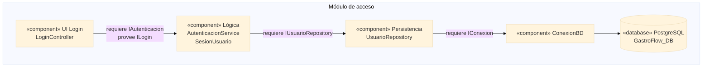

```mermaid
%%{init: { 'theme': 'base', 'flowchart': { 'curve': 'linear' } } }%%
flowchart TB
    subgraph ACCESO["Módulo de acceso"]
        UI_A["«component» UI Login<br>LoginController"]
        LOG_A["«component» Lógica<br>AutenticacionService<br>SesionUsuario"]
        PER_A["«component» Persistencia<br>UsuarioRepository"]
        CONN_A["«component» ConexionBD"]
        BD_A[("«database» PostgreSQL<br>GastroFlow_DB")]
    end

    UI_A -->|requiere IAutenticacion<br>provee ILogin| LOG_A
    LOG_A -->|requiere IUsuarioRepository| PER_A
    PER_A -->|requiere IConexion| CONN_A
    CONN_A --> BD_A
```
