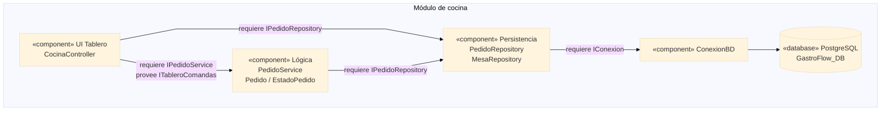

```mermaid
%%{init: { 'theme': 'base', 'flowchart': { 'curve': 'linear' } } }%%
flowchart TB
    subgraph COCINA["Módulo de cocina"]
        UI_C["«component» UI Tablero<br>CocinaController"]
        LOG_C["«component» Lógica<br>PedidoService<br>Pedido / EstadoPedido"]
        PER_C["«component» Persistencia<br>PedidoRepository<br>MesaRepository"]
        CONN_C["«component» ConexionBD"]
        BD_C[("«database» PostgreSQL<br>GastroFlow_DB")]
    end

    UI_C -->|requiere IPedidoService<br>provee ITableroComandas| LOG_C
    UI_C -->|requiere IPedidoRepository| PER_C
    LOG_C -->|requiere IPedidoRepository| PER_C
    PER_C -->|requiere IConexion| CONN_C
    CONN_C --> BD_C
```
