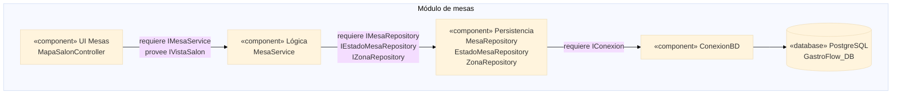

```mermaid
%%{init: { 'theme': 'base', 'flowchart': { 'curve': 'linear' } } }%%
flowchart TB
    subgraph MESAS["Módulo de mesas"]
        UI_M["«component» UI Mesas<br>MapaSalonController"]
        LOG_M["«component» Lógica<br>MesaService"]
        PER_M["«component» Persistencia<br>MesaRepository<br>EstadoMesaRepository<br>ZonaRepository"]
        CONN_M["«component» ConexionBD"]
        BD_M[("«database» PostgreSQL<br>GastroFlow_DB")]
    end

    UI_M -->|requiere IMesaService<br>provee IVistaSalon| LOG_M
    LOG_M -->|requiere IMesaRepository<br>IEstadoMesaRepository<br>IZonaRepository| PER_M
    PER_M -->|requiere IConexion| CONN_M
    CONN_M --> BD_M
```
