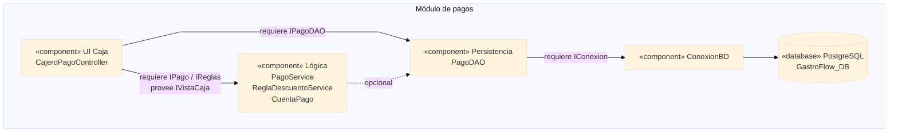

```mermaid
%%{init: { 'theme': 'base', 'flowchart': { 'curve': 'linear' } } }%%
flowchart TB
    subgraph PAGOS["Módulo de pagos"]
        UI_P["«component» UI Caja<br>CajeroPagoController"]
        LOG_P["«component» Lógica<br>PagoService<br>ReglaDescuentoService<br>CuentaPago"]
        PER_P["«component» Persistencia<br>PagoDAO"]
        CONN_P["«component» ConexionBD"]
        BD_P[("«database» PostgreSQL<br>GastroFlow_DB")]
    end

    UI_P -->|requiere IPago / IReglas<br>provee IVistaCaja| LOG_P
    UI_P -->|requiere IPagoDAO| PER_P
    LOG_P -.->|opcional| PER_P
    PER_P -->|requiere IConexion| CONN_P
    CONN_P --> BD_P
```
