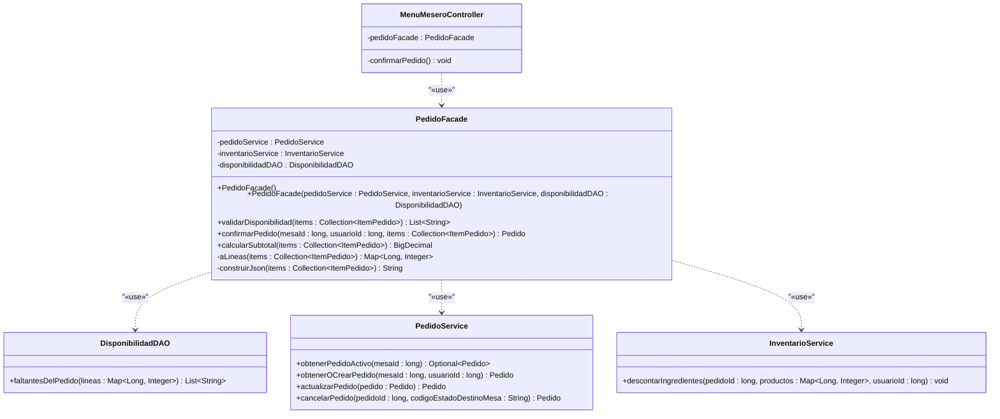

```mermaid
classDiagram
    direction TD

    class MenuMeseroController {
        -pedidoFacade : PedidoFacade
        -confirmarPedido() void
    }

    class PedidoFacade {
        -pedidoService : PedidoService
        -inventarioService : InventarioService
        -disponibilidadDAO : DisponibilidadDAO
        +PedidoFacade()
        +PedidoFacade(pedidoService : PedidoService, inventarioService : InventarioService, disponibilidadDAO : DisponibilidadDAO)
        +validarDisponibilidad(items : Collection~ItemPedido~) List~String~
        +confirmarPedido(mesaId : long, usuarioId : long, items : Collection~ItemPedido~) Pedido
        +calcularSubtotal(items : Collection~ItemPedido~) BigDecimal
        -aLineas(items : Collection~ItemPedido~) Map~Long, Integer~
        -construirJson(items : Collection~ItemPedido~) String
    }

    class DisponibilidadDAO {
        +faltantesDelPedido(lineas : Map~Long, Integer~) List~String~
    }

    class PedidoService {
        +obtenerPedidoActivo(mesaId : long) Optional~Pedido~
        +obtenerOCrearPedido(mesaId : long, usuarioId : long) Pedido
        +actualizarPedido(pedido : Pedido) Pedido
        +cancelarPedido(pedidoId : long, codigoEstadoDestinoMesa : String) Pedido
    }

    class InventarioService {
        +descontarIngredientes(pedidoId : long, productos : Map~Long, Integer~, usuarioId : long) void
    }

    MenuMeseroController ..> PedidoFacade : "«use»"
    PedidoFacade ..> DisponibilidadDAO : "«use»"
    PedidoFacade ..> PedidoService : "«use»"
    PedidoFacade ..> InventarioService : "«use»"
```