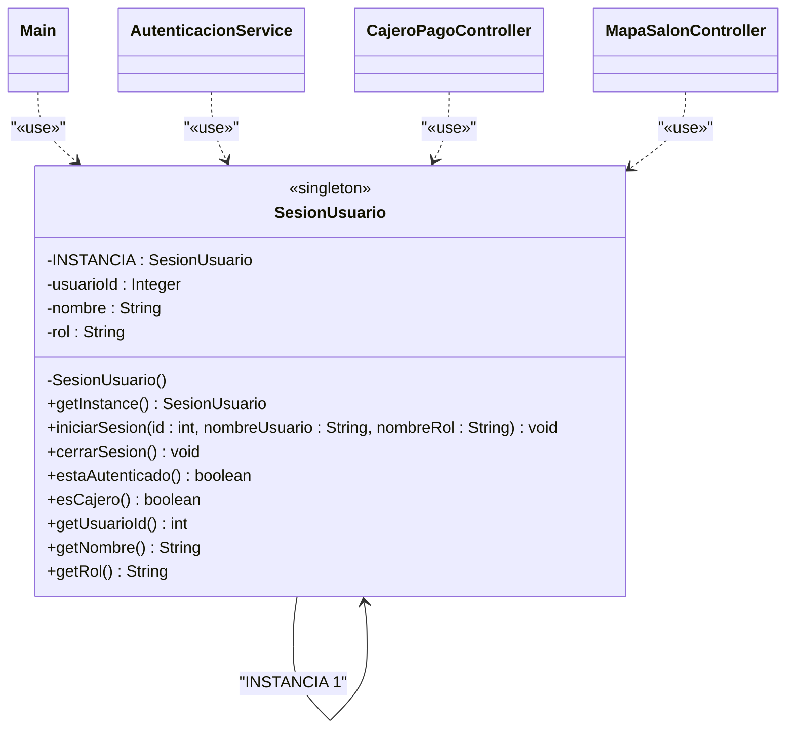

```mermaid
classDiagram
    direction TD

    class Main
    class AutenticacionService
    class CajeroPagoController
    class MapaSalonController

    class SesionUsuario {
        <<singleton>>
        -INSTANCIA : SesionUsuario
        -usuarioId : Integer
        -nombre : String
        -rol : String
        -SesionUsuario()
        +getInstance() SesionUsuario
        +iniciarSesion(id : int, nombreUsuario : String, nombreRol : String) void
        +cerrarSesion() void
        +estaAutenticado() boolean
        +esCajero() boolean
        +getUsuarioId() int
        +getNombre() String
        +getRol() String
    }

    Main ..> SesionUsuario : "«use»"
    AutenticacionService ..> SesionUsuario : "«use»"
    CajeroPagoController ..> SesionUsuario : "«use»"
    MapaSalonController ..> SesionUsuario : "«use»"
    
    %% Relación recursiva (bucle)
    SesionUsuario --> SesionUsuario : "INSTANCIA 1"
```
