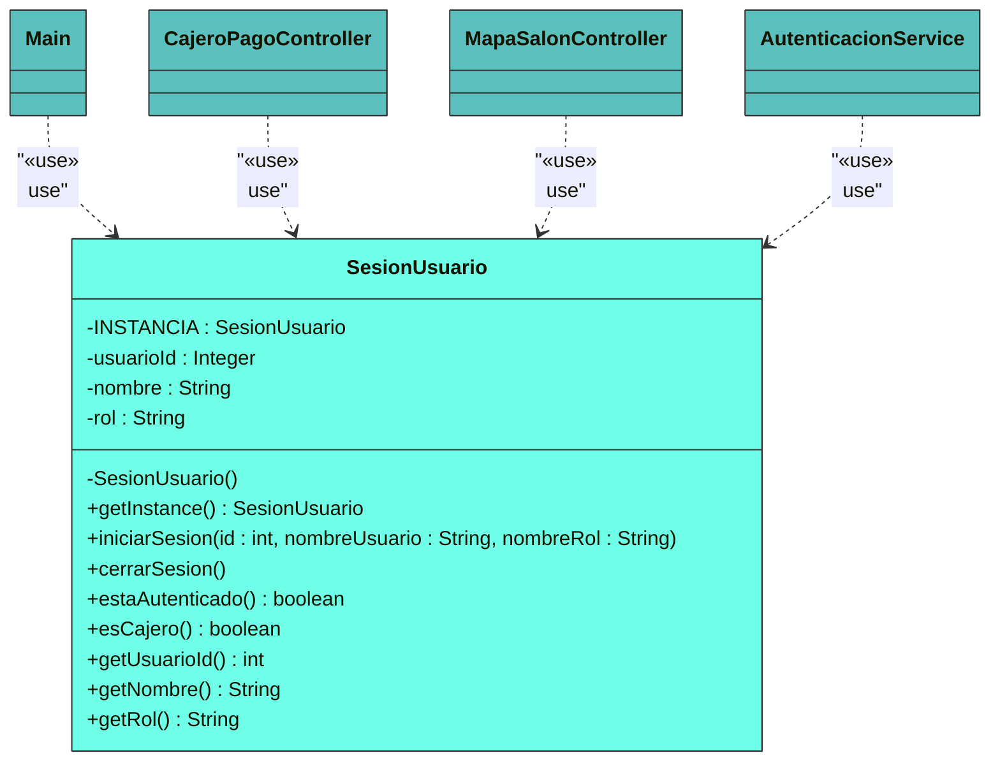

```mermaid
classDiagram
    direction TD

    class Main
    class CajeroPagoController
    class MapaSalonController
    class AutenticacionService

    class SesionUsuario {
        -INSTANCIA : SesionUsuario
        -usuarioId : Integer
        -nombre : String
        -rol : String
        -SesionUsuario()
        +getInstance() SesionUsuario
        +iniciarSesion(id : int, nombreUsuario : String, nombreRol : String)
        +cerrarSesion()
        +estaAutenticado() boolean
        +esCajero() boolean
        +getUsuarioId() int
        +getNombre() String
        +getRol() String
    }

    Main ..> SesionUsuario : "«use»<br>use"
    CajeroPagoController ..> SesionUsuario : "«use»<br>use"
    MapaSalonController ..> SesionUsuario : "«use»<br>use"
    AutenticacionService ..> SesionUsuario : "«use»<br>use"

    %% Estilos visuales personalizados
    style Main fill:#5bc0be,stroke:#333,stroke-width:1px
    style CajeroPagoController fill:#5bc0be,stroke:#333,stroke-width:1px
    style MapaSalonController fill:#5bc0be,stroke:#333,stroke-width:1px
    style AutenticacionService fill:#5bc0be,stroke:#333,stroke-width:1px
    style SesionUsuario fill:#6fffe9,stroke:#333,stroke-width:1px
```